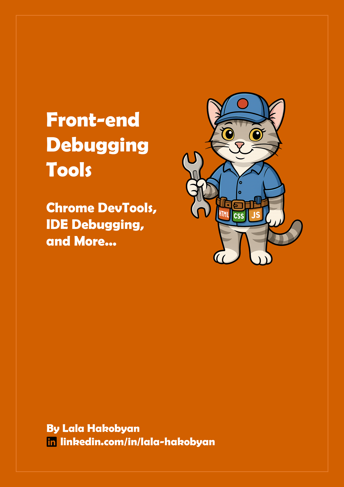
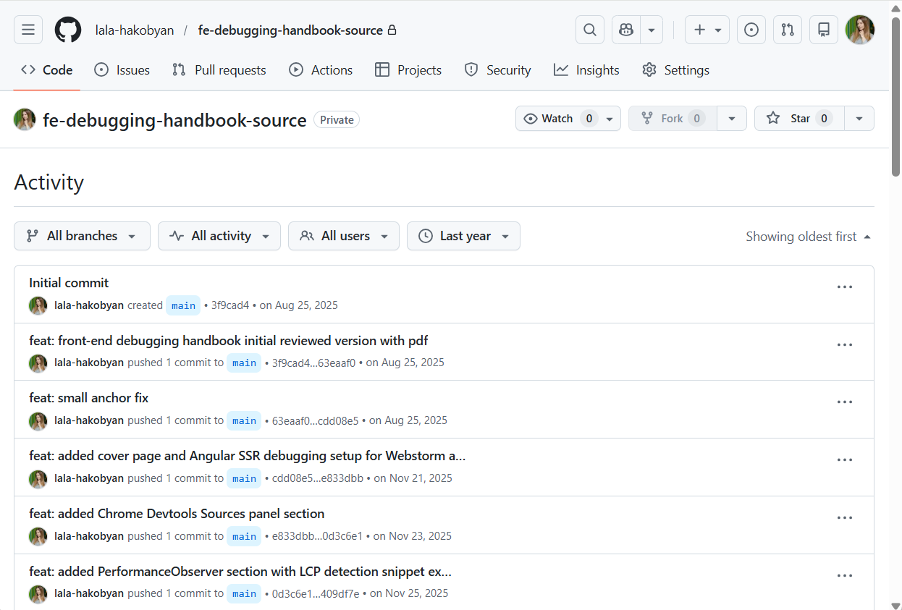

# Front-end Debugging Tools Handbook
A comprehensive guide to the tools for debugging modern, complex front-end applications. This handbook provides practical, real-world guidance on a complete suite of tools, from in-browser DevTools and framework extensions to the integrated debugger in your code editor.

**Get the latest version of the handbook [here](/releases/Front-end-Debugging-Tools-v0.1.0-2026-by-Lala-Hakobyan.pdf).**

## Introduction

In an era where AI can generate code in seconds, the skill of **debugging** has become more critical than ever. AI often acts like a smart junior developer who is knowledgeable but lacks real-world experience. Our role as engineers is to **validate**, **debug** and **harden** that code for production.

During my career, I witnessed even strong senior engineers relying primarily on the **Console** for debugging. While `console.log()` is a fast and useful tool (don't get me wrong: I also use it for quick debugging), it's often insufficient for debugging today's complex, multi-layered front-end applications with their distinct UI, state management and data layers. Furthermore, when you encounter an urgent production issue, you don't have the time to add console logs, redeploy the application and debug that version with logs. You need to already have powerful tools at your fingertips to act quickly and keep customers satisfied.

In this guide, I share the set of powerful tools I recommend and use personally in my debugging workflows. This is my personal toolkit for gaining the deep visibility needed to debug complex, modern applications efficiently. It combines my 9 years of experience in front-end engineering with new and modern tools I learned and adopted during this past year.   
You will learn **how to start with a tool**, **dive deep into the concepts** associated with it and **understand when to use it**. Whether you debug a local application, AI-generated code, production bugs, or just perform quality testing, the knowledge gained in this handbook will help make your debugging process smoother and faster, saving you countless hours.

To verify the concepts in this handbook, I relied only on authoritative resources: official documentation from the Google team, deep dives by community experts, as well as framework and library teams (React, Angular, Redux). At the end of the handbook, you will find the **Documentation and Resources** chapter to continue and dive deeper.

All screenshots in this handbook are from my personal POC projects using recent versions of the technologies (Angular 20, Next.js 16, React 19, Node.js 22). I also used the recent versions of the Chrome browser, IDEs (Cursor, WebStorm) and extensions (Redux DevTools, React DevTools and Angular DevTools) to present the most up-to-date information for you. You can find more about the projects and tools used in the screenshots in a separate **Technical Configuration** chapter at the end of the handbook.

It is important to note that the purpose of this handbook is not to replace official documentation. Instead, it is aligned with it and, in some cases, offers more practical, up-to-date guidance. The goal is to empower you with a comprehensive toolset to debug complex front-end applications in the era of AI.
While I plan to release updates as tools evolve, technologies move very fast. New features can be added or removed, and interfaces can be updated, but the core toolset and debugging principles will remain the same.

I hope you enjoy this handbook and find it genuinely useful in your everyday debugging flows.

## Table of Contents

This handbook provides comprehensive fundamental and deep knowledge about debugging front-end applications.
Below are just some highlights of what it covers:

- **Chrome DevTools**
    - Analyze performance of your application with Lighthouse, deep dive into Performance panel, profiling and underlying concepts.
    - Debug CORS errors, caching headers and access tokens in Network panel.
    - Debug bfcache, speculation rules and Web Workers through Application panel.
    - Simulate Network throttling and add custom devices for effective cross-browser testing.
    - Learn how to use AI innovations and get recommendations from Gemini right in the DevTools to help you with your debugging flow.
- **Browser Debugger**
    - Learn how to use browser debugger to quickly debug your client applications.
- **IDE Debugging**
    - Set up Debugger for your Cursor and WebStorm IDEs for complex, multi-layer Next.js application and SSR Angular application.
    - Learn troubleshooting steps to overcome unbound debugger breakpoints or port conflicts.
- **Framework and Library Specific Debugging Tools**
    - Deep dive into Angular DevTools, learn how to understand Profiler, debug signals and hydration.
    - Deep dive into React DevTools, understand how to profile and identify unnecessary rerenders.
    - Learn what is Redux and how to use Redux DevTools to debug state of your application not only in Redux but also in Zustand.
- **PerformanceObserver Interface, `performance.now()` Method and Profiler API**
    -  Learn how to use these specific APIs to measure performance of your components and application.
- **Front-end Monitoring**
    - Learn what is front-end monitoring, why it is important and a basic setup to start small.
- **Chrome DevTools MCP Server (Public Preview)**
    - Learn how to use newly released Chrome DevTools MCP server to create automatic E2E tests and assign your IDE to verify its own code in the browser.
    - Understand its current state and security risks.

All these topics and much more you can find in this handbook. For the full table of contents please refer to the **[Table of Contents](./TABLE-OF-CONTENTS.md)**.

## How to Read

While this handbook is intended to give you advanced knowledge on front-end debugging tools, it is designed in a way that different levels of engineers can benefit from it, from junior to staff.
- **Junior engineers** can gain fundamental knowledge of a powerful toolkit for debugging front-end applications. And they may consider skipping some deep dives with the intention to get back to them later.
- **Middle engineers** who want to upskill to senior will definitely benefit from deep dives, advanced debugging techniques and engineering best practices listed in this handbook.
- **Senior/Staff engineers** may selectively choose areas that feel interesting to them and dive deeper into what is needed. Also, they may use this handbook as reference for team upskilling.

My advice is: regardless of the level, read the whole book because I am sure that even the most familiar sections may give you new insights and debugging tips: I myself learned a lot while writing this handbook.   
However, the topics are independent and necessary sections are referenced whenever needed, so if you are busy, you can start by checking the **Summary** section where it lists the problem each tool solves, and pick the tool that you need at the moment or are interested in diving deeper.  
Alternatively, I advise to check the [Table of Contents](./TABLE-OF-CONTENTS.md), which is detailed enough to give you an overview of what's included in the handbook and help you to choose sections that you are interested in.

Happy reading! I hope you will enjoy it.

## About Me

Hello! I'm Lala Hakobyan, a Senior Front-end Engineer with over 15 years of experience in the tech industry, with the last 9 years in front-end engineering.
Throughout my career, I have held different roles: **Full-Stack Engineer**, **Project Manager**, **Front-end Engineer** and **Software Engineering Team Lead**.
The experience gained from this journey allows me to bridge the gap between engineering and product, ensuring technical decisions align with user needs.

While I enjoyed and committed myself to each role I took, front-end engineering remains my true passion. I'm passionate about delivering seamless experiences to end users and building scalable, maintainable and high-quality applications, from architecture to implementation.

Throughout my career, I've specialized in technologies like **Angular**, **TypeScript** and **Microfrontend architecture**. Recently, I broadened my stack to include **React** and **Next.js**, leveraging **AI** to enhance engineering productivity. During my career, I continuously shared knowledge with peers, maintained technical documentation and contributed to establishing engineering best practices. This handbook is one of the independent initiatives I took on in 2025: a project that combines **my passion for innovation and knowledge sharing**. It is my way of sharing the practical debugging techniques and insights I've learned from solving complex problems in real-world projects, including modern techniques I adopted during the past year.

Thank you for reading this handbook! I hope you enjoyed it and found it helpful in your everyday debugging flows.    
If you found this handbook valuable, consider **giving it a star on GitHub** to help more people discover it.

**I'd love to hear from you. For feedback, questions, updates or just to connect over meaningful tech conversations, you can find me on Linkedin: [linkedin.com/in/lala-hakobyan](https://www.linkedin.com/in/lala-hakobyan/).**

> **Important Note:** This copy is the FREE version of the handbook for the developer community. If you see this handbook for sale on any platform, please inform me via LinkedIn so that I can prevent its illegal usage.

## Story

I started writing this handbook in August 2025. Initially, I started it as a short guide to include in my knowledge base. Then, after looking into the first version, I realized it would be useful, but I could make it more helpful by adding my experience, explaining concepts, and actually making the debugging process easier. So it became a separate initiative.

I started maintaining it in a separate repository, where I also store resources for publishing: styles, screenshots from my POC projects, and typography rules.

When I committed the initial version, I wanted to create a theme which would help my fellow engineers to soften the hard debugging process and make learning more enjoyable. So the orange color and cat mascot (mimicking my cat) came to my mind. I used AI to bring the cat mascot idea to life. Also, I included more screenshots where possible to make concepts more understandable and learning easier.

During the last few months, I continuously improved the handbook. I added a Chrome MCP section when it was released, Speculation Rules, Performance Observer API and some other modern features as well. But at some point, I realized that I can always add depth, more details, and even more sections. So I decided to stay pragmatic, code freeze on a list of features by the end of 2025, do a final review and release it for the community. I have some features in mind, and also suggestions by the community that will be included in the next versions of my handbook. You can find them in the [roadmap file](./ROADMAP.md).

I really hope you will enjoy it. I will be happy to hear your [feedback](https://github.com/lala-hakobyan/front-end-debugging-handbook/issues) and consider it for future updates.

## Releases
To check all release notes, please refer to the **[Release Notes](./RELEASE-NOTES.md)** file.

## Roadmap
To learn more about the future release roadmap and updates, check the **[Project Roadmap](./ROADMAP.md)** file.

## Feedback and Requests
For suggestions, feedback or to request a topic, please use the Issues tab on GitHub:
**[Issues page on GitHub](https://github.com/lala-hakobyan/front-end-debugging-handbook/issues)**

## Official Sources
- [GitHub Repository](https://github.com/lala-hakobyan/front-end-debugging-handbook)
- Leanpub - Coming Soon

## License

**Copyright © 2026 Lala Hakobyan. All rights reserved.**

**You MAY**
- Download, read and use this handbook for learning and reference.
- Print it for personal use or internal training.
- Share the **unmodified** PDF internally, including within your company or educational institution.
- Quote short excerpts with **attribution** and a link to the official source.

**You MAY NOT (without prior written permission from the author)**
- Re-publish or re-upload this handbook publicly (website, platform or another repository).
- Sell the handbook or include it in paid products/courses.
- Distribute modified versions of the handbook text or images.

**Code Snippets**   
Original code snippets authored by Lala Hakobyan are licensed under the **[MIT License](https://github.com/lala-hakobyan/front-end-debugging-handbook/blob/main/LICENSE-CODE)** and may be used in personal and commercial projects.

**Third-party Content**   
Any third-party code/assets that are credited should remain under their original licenses.

**Official Source**   
For the latest version and new updates, please refer to the official repository:   
[https://github.com/lala-hakobyan/front-end-debugging-handbook](https://github.com/lala-hakobyan/front-end-debugging-handbook)

**Attribution Example**   
If you quote this handbook, please use the following format:

> Source: "Front-end Debugging Tools Handbook" by Lala Hakobyan. Copyright © 2026. All Rights Reserved. Available at: https://github.com/lala-hakobyan/front-end-debugging-handbook
